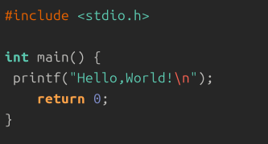
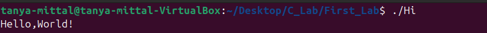
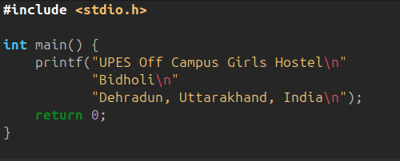
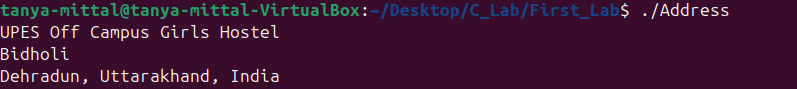
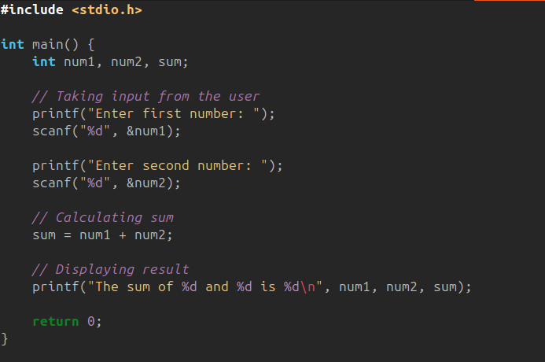
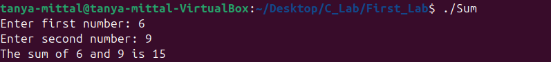
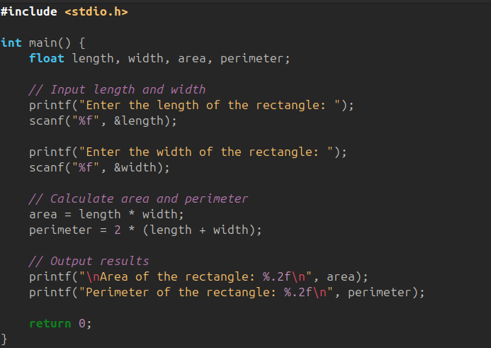
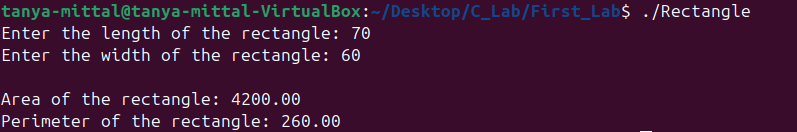
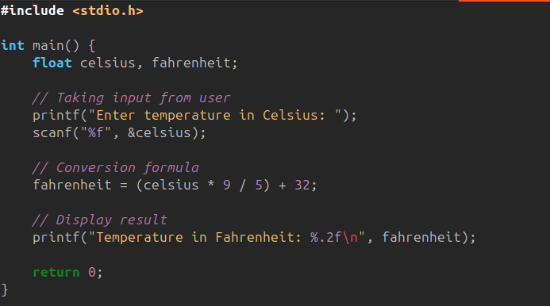
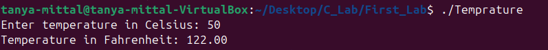

# **Lab 1: Basic C Programming Tasks**

A structured introduction to writing simple C programs, understanding input/output, and applying basic formulas.

## **Objective**

To understand and implement basic C programs covering printing, user input, arithmetic operations, and simple formulas.

---

### **1. Write a C program to print "Hello World"**

**Code:**

**Output:**

---

### **2. Write a C Program to print the address in multiple lines using only one printf**

**Code:**

**Output:**

---

### **3. Write a C program to add two numbers, take numbers from user**

**Code:**

**Output:**

---

### **4. Write a C program to calculate the area and perimeter of a rectangle based on its length and width**

**Code:**

**Output:**

---

### **5. Write a C program to convert temperature from Celsius to Fahrenheit**

Formula: **F = (C × 9/5) + 32**

**Code:**

**Output:**

---

