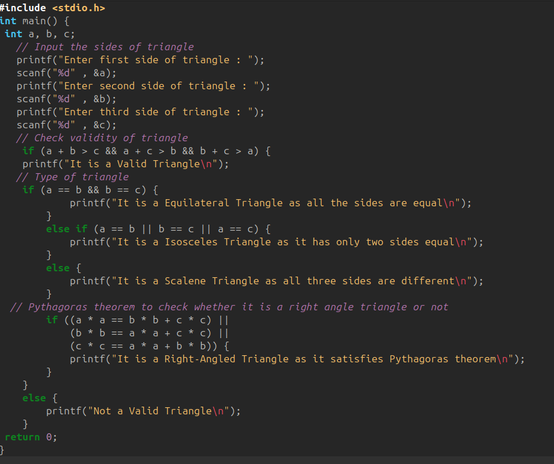
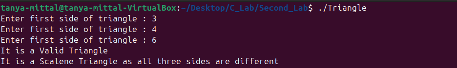
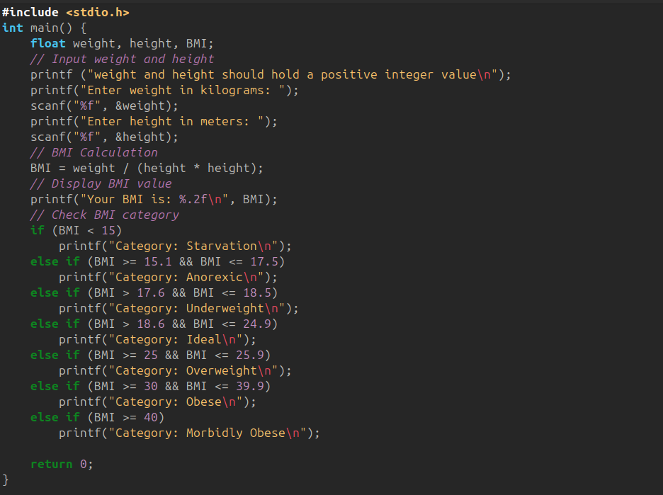
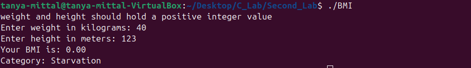

# **Lab 2: Conditional Logic and Classification in C**

## **Objective**

To practice decision-making in C programs by validating triangle types and computing BMI categories.

---

## **1. Program: Check Triangle Validity and Type**

Write a C program to:

* Take three sides of a triangle as input from the user.
* Check whether the triangle is **valid**.
* If valid, determine whether it is:

  * **Equilateral**
  * **Isosceles**
  * **Scalene**
  * **Right-angled**

### **Code:**

### **Output:**

---

## **2. Program: Compute BMI and Determine Category**

Write a C program to:

* Take **weight (kg)** and **height (meters)** as input.
* Compute BMI using the formula:

[
BMI = \frac{weight}{height \times height}
]

* Display the corresponding BMI category as per the table below.

### **BMI Classification Table**

| Category       | BMI Range      |
| -------------- | -------------- |
| Starvation     | < 15           |
| Anorexic       | 15.1 – 17.5    |
| Underweight    | 17.6 – 18.5    |
| Ideal          | 18.6 – 24.9    |
| Overweight     | 25 – 25.9      |
| Obese          | 30 – 39.9      |
| Morbidly Obese | 40.0 and above |

### **Code:**

### **Output:**

---

