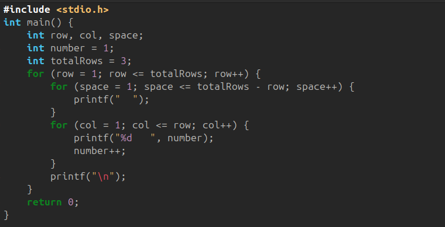

# **Lab 3: Pattern Generation in C**

## **Objective**

To write C programs that generate specific numeric patterns using nested loops.

---

## **3. Program: Generate the Following Sets of Output**

You are required to write two programs (or one program with choices) to print the following patterns.

---

## **a. Pattern A**

```
   1
  2 3
4  5  6
```

### **Code:**



### **Output:**

[Image](./images/Loop1output.png)

---

## **b. Pattern B**

```
   1
  1 1
 1 2 1
1 3 3 1
```

*(This is Pascal's Triangle – first four rows)*

### **Code:**

[Image](./images/Loop2.png)

### **Output:**

[Image](./images/Loop2output.png)

---

