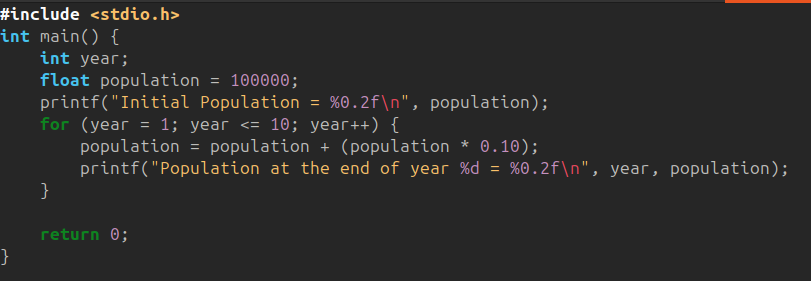
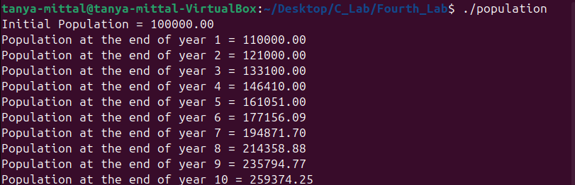
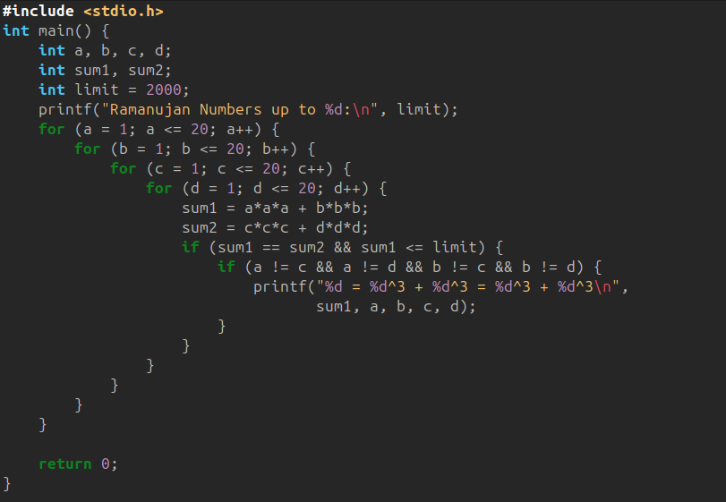
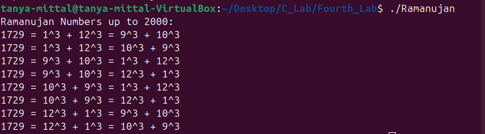

# **Lab 4: Looping, Growth Calculations & Special Numbers in C**

## **Objective**

To apply loops for real-world calculations and to generate special mathematical numbers using C programming.

---

## **1. Program: Population Growth Over 10 Years**

A town has an initial population of **100000**. The population increases at a steady rate of **10% per year**.

Write a C program to compute and display the population at the end of each year for **10 years**.

### **Formula Used**

```
new_population = old_population + (0.10 * old_population)
```

### **Code:**



### **Output:**



---

## **2. Program: Ramanujan (Taxi-Cab) Numbers up to a Given Limit**

A **Ramanujan Number** is the smallest number that can be expressed as the sum of two cubes in **two different ways**.

Example:

```
1729 = 12^3 + 1^3 = 10^3 + 9^3
```

Write a C program to:

* Take a limit **L** from the user.
* Print all Ramanujan-type numbers up to that limit.

For example:
If **L = 20**, program checks combinations of cubes up to 20.

### **Code:**



### **Output:**



---

